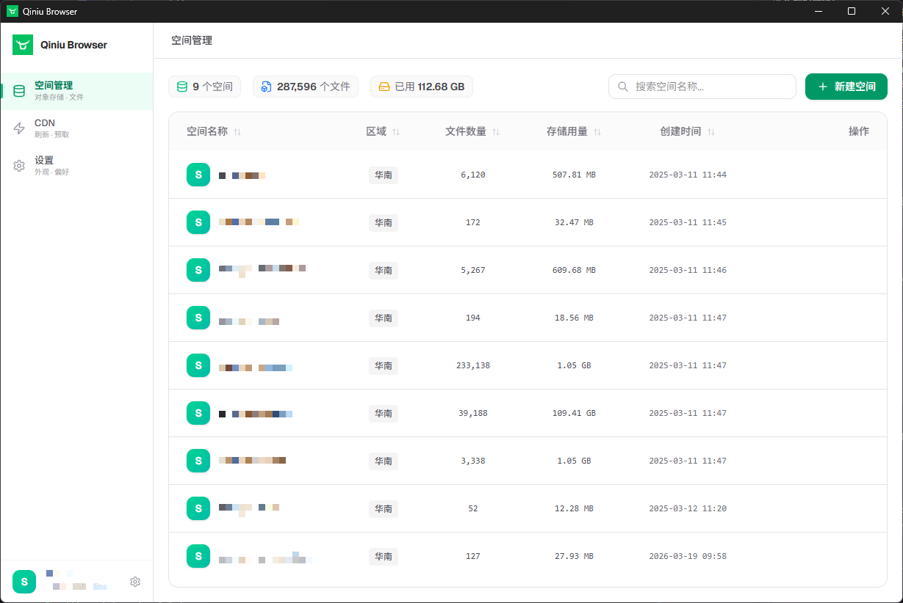

# Qiniu Browser

<div align="center">
  
  <p>现代化的七牛云对象存储桌面客户端</p>
</div>

## 📸 预览



## ✨ 特性

- 🚀 **高性能** - 基于 Tauri 2.0 构建，启动速度快，资源占用低
- 🎨 **现代化界面** - 使用 Shadcn UI 组件库，支持亮色/暗色主题
- 🔐 **安全可靠** - 凭证本地存储，支持从 Kodo Browser 导入历史记录
- 📦 **空间管理** - 查看和管理所有存储空间
- 📁 **文件操作** - 上传、下载、删除、重命名文件和文件夹
- 🔗 **外链管理** - 自动获取绑定域名，一键复制文件外链
- 🌐 **CDN 管理** - 支持 URL 刷新和目录刷新
- 💻 **跨平台** - 支持 Windows、macOS、Linux

## 🚀 快速开始

### 下载安装

前往 [Releases](https://github.com/YOUR_USERNAME/qiniu-browser/releases) 页面下载对应平台的安装包：

- **Windows**: `.exe` 或 `.msi`
- **macOS**: `.dmg`
- **Linux**: `.deb` 或 `.AppImage`

### 开发环境

```bash
# 安装依赖
npm install

# 启动开发服务器
npm run tauri dev

# 构建生产版本
npm run tauri build
```

## 📖 使用说明

### 登录

1. 首次使用需要输入七牛云的 AccessKey 和 SecretKey
2. 可选填写账号描述，方便区分多个账号
3. 勾选"记住凭证"可保存登录信息

### 空间管理

- 查看所有存储空间列表
- 创建新的存储空间
- 删除存储空间
- 进入空间查看文件

### 文件操作

- **上传**: 点击上传按钮选择文件
- **下载**: 右键点击文件选择下载
- **删除**: 支持单个或批量删除
- **重命名**: 右键点击文件选择重命名
- **复制外链**: 右键点击文件复制访问链接

### CDN 管理

- URL 刷新：刷新指定文件的 CDN 缓存
- 目录刷新：刷新整个目录的 CDN 缓存

## 📦 发布流程

### 自动发布

使用内置脚本自动更新版本号并触发构建：

```bash
npm run release 0.0.2
```

### 手动发布

```bash
# 1. 更新版本号
# 编辑 package.json, src-tauri/Cargo.toml, src-tauri/tauri.conf.json

# 2. 提交并创建 tag
git add .
git commit -m "chore: bump version to 0.0.2"
git tag v0.0.2
git push origin main
git push origin v0.0.2
```

推送 tag 后，GitHub Actions 会自动构建所有平台的安装包。

详细说明请查看 [发布文档](./docs/guides/RELEASE.md)。

## 🛠️ 技术栈

- **前端**: React 18 + TypeScript + Vite
- **UI**: Tailwind CSS 4 + Shadcn UI
- **后端**: Rust + Tauri 2.0
- **状态管理**: Zustand

## 📝 开发计划

查看 [ROADMAP.md](./docs/ROADMAP.md) 了解项目规划和进度。

## 📄 许可证

MIT License

## 🤝 贡献

欢迎提交 Issue 和 Pull Request！
